# FINAL-PROJECT-OS-SERVER-SYSTEM-ADMIN---23.83.0961

Pada Repository tersebut berisi dokumentasi pengerjaan saya pada saat memberikan layanan server terhadap WEB yang sebelumnya saya buat.

## Spesifikasi Server
- Ubuntu Server 24.04.1
- Processor 4 Core
- Penyimpanan 30 GB

## Daftar Isi
- [Layanan Server Nginx](#1-layanan-nginx)
- [Layanan Server Apache2](#2-layanan-apache2)
- [Layanan Mysql](#3-layanan-mysql)
- [Layanan Grafana](#4-layanan-grafana)
- [Layanan Docker](#5-layanan-docker)


# 1. LAYANAN NGINX
Nginx adalah perangkat lunak web server open-source yang berfungsi sebagai reverse proxy, load balancer, dan HTTP cache. Nginx memiliki beberapa kelebihan, di antaranya: 
- Dapat menangani banyak koneksi secara bersamaan 
- Efisien dalam penggunaan sumber daya 
- Dukungan OS yang luas, termasuk Linux, Unix, dan Windows 
- Pemeliharaan konfigurasi real-time 

### Konfigurasi

### Langkah 1: Update Sistem
Pertama-tama, pastikan sistem Anda sudah diperbarui dengan perintah berikut:

```bash
sudo apt update
sudo apt upgrade

```

### Langkah 2: Instalasi Nginx
Instal Nginx dengan perintah berikut:

```bash
sudo apt install nginx
```

Setelah instalasi selesai, Anda dapat memulai dan mengaktifkan layanan Nginx:

```bash
sudo systemctl start nginx
sudo systemctl enable nginx
```

### Langkah 3: Izinkan Akses Firewall
Jika Anda menggunakan UFW (Uncomplicated Firewall), izinkan akses ke port 80 (HTTP) dan 443 (HTTPS):

```bash
sudo ufw allow 'Nginx HTTP'
sudo ufw allow 'Nginx HTTPS'
sudo ufw status
```

### Langkah 4: Konfigurasi Virtual Host
Buat direktori untuk situs web Anda, disini saya menamakan file nya itu "server1":
```bash
sudo mkdir -p /var/www/server1
sudo chown -R $USER:$USER /var/www/server1
sudo chmod -R 755 /var/www
```

### Clone File WEB pada github saya
Opsional jika tidak mempunyai WEB, bisa membuat File HTML sederhana seperti:
```bash
echo "Hello, World!" | sudo tee /var/www/your_domain/index.html
```

clone github, masuk terlebih dahulu ke direktori yang sudah di buat pada langkah 4:
```bash
git clone https://github.com/okeyy07-rgb/cybershild.github.io.git
```

Buat konfigurasi virtual host di /etc/nginx/sites-available/server1:
```bash
sudo nano /etc/nginx/sites-available/your_domain
```
"your_domain" di ganti dengna nama sesuai yang anda inginkan"

Tambahkan konfigurasi berikut:
```bash
# Blok server HTTP (port 80)
server {
    listen 80 default_server;
    server_name 192.168.32.129;
    root /var/www/server1/cybershildd.gihub.io;
    index index.html;
    location / {
        auth_basic "Restricted Content";
        auth_basic_user_file /etc/nginx/.htpasswd;
        try_files $uri $uri/ =404;
        ## Rate Limiting ##
        limit_req zone=one burst=5 nodelay;
        ## Security Headers ##
        add_header X-Frame-Options "SAMEORIGIN";
        add_header X-XSS-Protection "1; mode=block";
        add_header X-Content-Type-Options "nosniff";
        add_header Strict-Transport-Security "max-age=31536000; includeSubdomains; preload";
        ## Cache Control ##
        expires 1d;
        add_header Cache-Control "public, must-revalidate, proxy-revalidate";
    }
}

# Blok server HTTPS (port 443)
server {
    listen 443 ssl http2;
    server_name 192.168.32.129;
    ssl_certificate /etc/ssl/certs/nginx-selfsigned.crt;
    ssl_certificate_key /etc/ssl/private/nginx-selfsigned.key;
    root /var/www/server1/cybershildd.gihub.io;
    index index.html;
    location / {
        auth_basic "Restricted Content";
        auth_basic_user_file /etc/nginx/.htpasswd;
        try_files $uri $uri/ =404;
        ## Security Headers ##
        add_header X-Frame-Options "SAMEORIGIN";
        add_header X-XSS-Protection "1; mode=block";
        add_header X-Content-Type-Options "nosniff";
        add_header Strict-Transport-Security "max-age=31536000; includeSubdomains; preload";
        ## Cache Control ##
        expires 1d;
        add_header Cache-Control "public, must-revalidate, proxy-revalidate";
    }
}

# Blok proxy cache (gunakan port berbeda atau lokasi berbeda)
upstream backend {
    server 127.0.0.1:8080;  # Sesuaikan dengan backend Anda
}

server {
    listen 8081;  # Gunakan port berbeda
    server_name 192.168.32.129;
    location / {
        proxy_cache my_cache;
        proxy_cache_valid 200 302 10m;
        proxy_cache_valid 404 1m;
        proxy_cache_use_stale error timeout invalid_header updating http_500 http_502 http_503 http_504;
        proxy_cache_lock on;
        proxy_cache_revalidate on;
        proxy_pass http://backend;
        proxy_set_header Host $host;
        proxy_set_header X-Real-IP $remote_addr;
        proxy_set_header X-Forwarded-For $proxy_add_x_forwarded_for;
        ## Security Headers ##
        add_header X-Frame-Options "SAMEORIGIN";
        add_header X-XSS-Protection "1; mode=block";
        add_header X-Content-Type-Options "nosniff";
        add_header Strict-Transport-Security "max-age=31536000; includeSubdomains; preload";
        ## Cache Control ##
        expires 1d;
        add_header Cache-Control "public, must-revalidate, proxy-revalidate";
    }
}
```
#### Berikut adalah tujuan dari konfigurasi Nginx yang Anda berikan:

#### HTTP dan HTTPS Server
- Port 80 dan 443: Mendengarkan permintaan HTTP (port 80) dan HTTPS (port 443) untuk melayani konten website Anda.

- root & index: Menentukan lokasi file website dan file utama yang akan dimuat saat mengakses website.

- Basic Authentication: Melindungi konten dengan otentikasi dasar menggunakan username dan password.

- Rate Limiting: Mengontrol jumlah permintaan yang dapat dilakukan oleh klien untuk mencegah serangan DoS 
(Denial of Service).

- Security Headers: Menambahkan header keamanan untuk melindungi website dari berbagai jenis serangan 
(misalnya, clickjacking, XSS, dan MIME type sniffing).

- Cache Control: Mengatur kebijakan cache untuk meningkatkan kinerja dan mengurangi beban server.

#### Proxy Cache Server (Port 8081)
- Backend Proxy: Meneruskan permintaan ke backend server (127.0.0.1:8080) yang mungkin menjalankan aplikasi Anda.

- Proxy Cache: Menyimpan cache dari respons backend untuk meningkatkan kinerja dengan mengurangi beban pada 
server backend.

- Cache Policies: Mengatur masa berlaku cache dan bagaimana cache digunakan kembali jika terjadi kesalahan.

- Dengan konfigurasi ini, Anda memastikan bahwa website Anda aman, cepat, dan dapat menangani beban lalu lintas
 yang tinggi dengan efisien.

### Konfigurasi global pada nginx
masukkan konfigurasi berikut pada /etc/nginx/nginx.conf:
```bash
user www-data;
worker_processes auto;
pid /run/nginx.pid;
error_log /var/log/nginx/error.log;
include /etc/nginx/modules-enabled/*.conf;

events {
        worker_connections 768;
        # multi_accept on;
}

http {
        # Tambahkan konfigurasi cache di sini
    proxy_cache_path /var/cache/nginx levels=1:2 keys_zone=my_cache:10m max_size=10g inactive=60m use_temp_path=off;
        # Tambahkan konfigurasi rate limiting
    limit_req_zone $binary_remote_addr zone=one:10m rate=1r/s;

        ##
        # Basic Settings
        ##

        sendfile on;
        tcp_nopush on;
        types_hash_max_size 2048;
        # server_tokens off;

        # server_names_hash_bucket_size 64;
        # server_name_in_redirect off;

        include /etc/nginx/mime.types;
        default_type application/octet-stream;

        ##
        # SSL Settings
        ##

        ssl_protocols TLSv1 TLSv1.1 TLSv1.2 TLSv1.3; # Dropping SSLv3, ref: POODLE
        ssl_prefer_server_ciphers on;

        ##
        # Logging Settings
        ##

        access_log /var/log/nginx/access.log;

        ##
        # Gzip Settings
        ##

        gzip on;

        # gzip_vary on;
        # gzip_proxied any;
        # gzip_comp_level 6;
        # gzip_buffers 16 8k;
        # gzip_http_version 1.1;
        # gzip_types text/plain text/css application/json application/javascript text/xml application/xml application/xml+rss text/javascript;

        ##
        # Virtual Host Configs
        ##

        include /etc/nginx/conf.d/*.conf;
        include /etc/nginx/sites-enabled/*;
}


#mail {
#       # See sample authentication script at:
#       # http://wiki.nginx.org/ImapAuthenticateWithApachePhpScript
#
#       # auth_http localhost/auth.php;
#       # pop3_capabilities "TOP" "USER";
#       # imap_capabilities "IMAP4rev1" "UIDPLUS";
#
#       server {
#               listen     localhost:110;
#               protocol   pop3;
#               proxy      on;
#       }
#
#       server {
#               listen     localhost:143;
#               protocol   imap;
#               proxy      on;
#       }
#}
```
## Langkah 5: Yang Harus Disiapkan Dari Konigurasi Diatas:
### 1. SSL Configuration
Buat sertifikat SSL self-signed untuk HTTPS:
```bash
sudo openssl req -x509 -nodes -days 365 -newkey rsa:2048 -keyout /etc/ssl/private/nginx-selfsigned.key -out /etc/ssl/certs/nginx-selfsigned.crt
```

### 2. Basic Authentication
Instal apache2-utils untuk membuat file .htpasswd:
```bash
sudo apt install apache2-utils
sudo htpasswd -c /etc/nginx/.htpasswd username
```

### 3. Proxy Cache
Buat direktori cache dan berikan izin yang sesuai:
```bash
sudo mkdir -p /var/cache/nginx
sudo chown -R www-data:www-data /var/cache/nginx
```
### 4. Rate Limiting
Tambahkan konfigurasi rate limiting di nginx.conf:
```bash
http {
    limit_req_zone $binary_remote_addr zone=one:10m rate=1r/s;
}
```

### 5. Firewall
Pastikan port yang diperlukan terbuka di firewall:
```bash
sudo ufw allow 80/tcp
sudo ufw allow 443/tcp
sudo ufw allow 8081/tcp
sudo ufw reload
```
### 5. SELinux (Jika digunakan)
 Pastikan SELinux memberikan izin yang sesuai:
```bash
sudo setsebool -P httpd_can_network_connect 1
sudo chcon -R -t httpd_sys_content_t /var/www/server1/cybershildd.gihub.io
```

### 6. Konfigurasi Nginx
ambahkan atau modifikasi konfigurasi sesuai contoh yang diberikan. Pastikan untuk menempatkan konfigurasi di 
file yang sesuai, seperti /etc/nginx/nginx.conf atau /etc/nginx/sites-available/server1

### 9. Restart Nginx
Setelah semua konfigurasi siap, restart Nginx untuk menerapkan perubahan:
```bash
sudo systemctl restart nginx
```
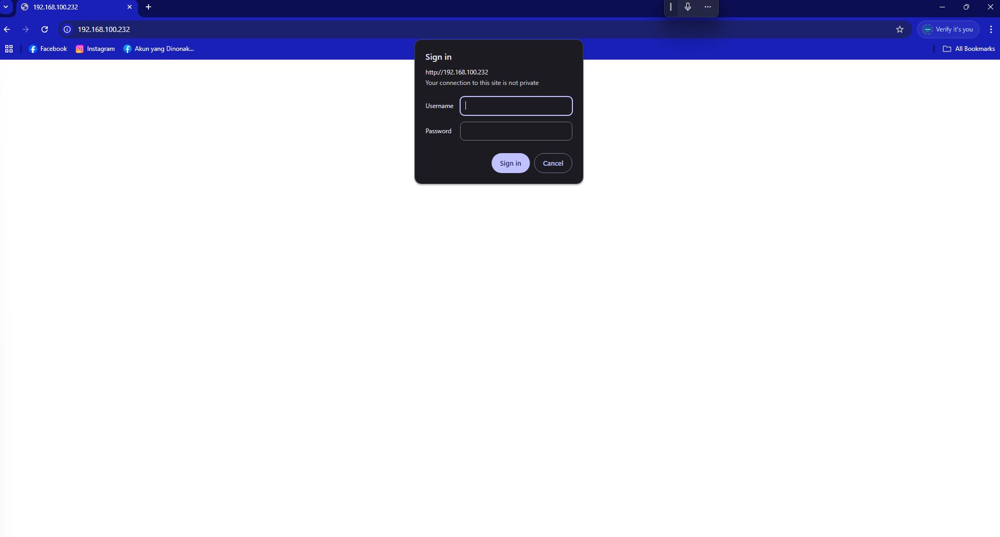

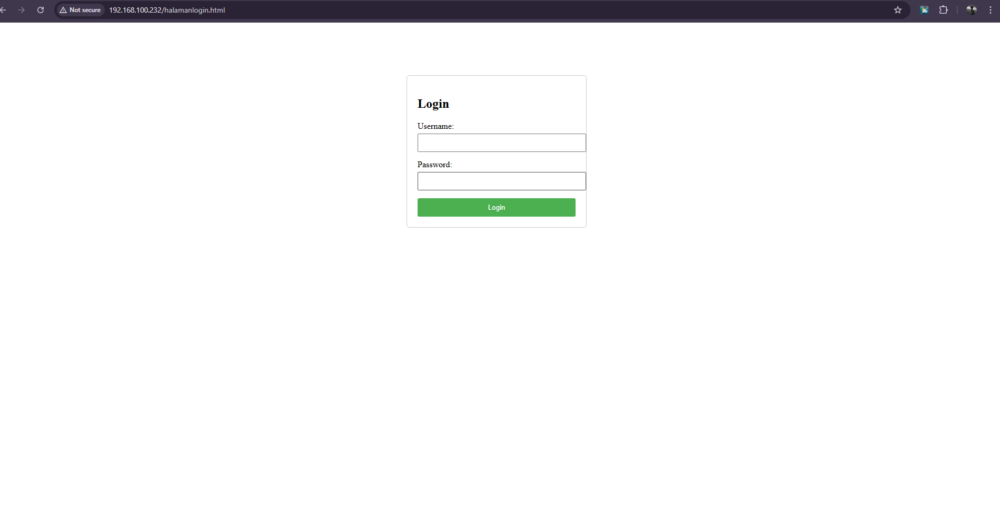
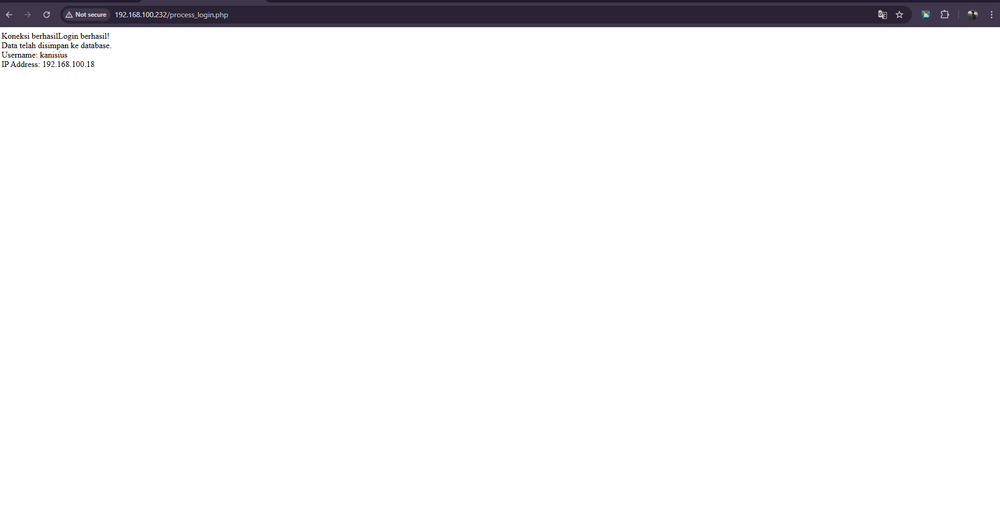
### OUTPUT DATABASE
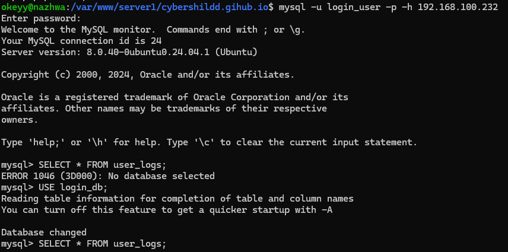
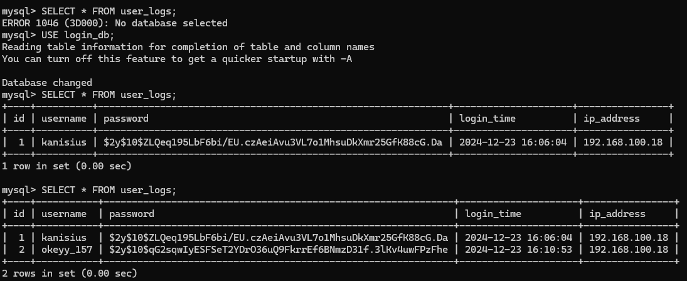


# 2. LAYANAN APACHE2
Apache2 adalah layanan web server yang berfungsi untuk mengelola dan melayani situs web dan aplikasi web melalui internet:

Cara kerja
Apache menerima permintaan dari browser pengunjung, memprosesnya, dan mengirimkan respons berupa halaman web atau konten lainnya. 


### Konfigurasi
### Langkah 1: Hentikan terlebih dahulu layanan nginx
```bash
sudo systemctl stop nginx
```

### Langkah 2: Instal Apache2
Pertama, instal Apache2 dengan perintah berikut:
```bash
sudo apt update
sudo apt install apache2
```

### Langkah 3: Clone Kembali WEb pada github
Opsional jika tidak mempunyai WEB, bisa membuat File HTML sederhana seperti:
```bash
echo "Hello, World!" | sudo tee /var/www/your_domain/index.html
```

clone github, masuk terlebih dahulu ke direktori server2:
```bash
git clone https://github.com/okeyy07-rgb/cybershild.github.io.git
```
Karena saya akan memakai cloningan sama dengan layanan nginx jadai saya tidak melakukan ini


### Langkah 4: Buat File Konfigurasi Virtual Host
Buat file konfigurasi virtual host untuk situs Anda di /etc/apache2/sites-available/server2.conf:
```bash
sudo nano /etc/apache2/sites-available/server2.conf
```

Tambahkan konfigurasi berikut:
```bash
<VirtualHost *:80>
    ServerAdmin webmaster@192.168.100.232
    ServerName 192.168.100.232
    DocumentRoot /var/www/server1/cybershildd.gihub.io

    <Directory /var/www/server1/cybershildd.gihub.io>
        Options Indexes FollowSymLinks
        AllowOverride All
        Require all granted
        AuthType Basic
        AuthName "Restricted Content"
        AuthUserFile /etc/apache2/.htpasswd
        Require valid-user
    </Directory>

    <FilesMatch \.php$>
        SetHandler "proxy:unix:/var/run/php/php7.4-fpm.sock|fcgi://localhost"
    </FilesMatch>

    # Rate Limiting
    <IfModule mod_ratelimit.c>
        SetOutputFilter RATE_LIMIT
        SetEnv rate-limit 400
    </IfModule>

    # Gzip Compression
    <IfModule mod_deflate.c>
        AddOutputFilterByType DEFLATE text/html text/plain text/xml text/css application/javascript application/json
    </IfModule>

    # Security Headers
    Header always set X-Frame-Options "SAMEORIGIN"
    Header always set X-XSS-Protection "1; mode=block"
    Header always set X-Content-Type-Options "nosniff"
    Header always set Strict-Transport-Security "max-age=31536000; includeSubdomains; preload"

    # Cache Control
    <FilesMatch "\.(html|css|js|png|jpg|jpeg|gif|ico)$">
        Header set Cache-Control "public, must-revalidate, proxy-revalidate, max-age=86400"
    </FilesMatch>

    ErrorLog ${APACHE_LOG_DIR}/error.log
    CustomLog ${APACHE_LOG_DIR}/access.log combined
</VirtualHost>
```
Pada Konfigurasi Apache tersebut, telah ditambahkan dengan beberapa fitur untuk meningkatkan kinerja dan keamanan layanan web. Pada bagian VirtualHost *:80, pengaturan dasar seperti ServerAdmin, ServerName, dan DocumentRoot sudah ada, serta pengaturan untuk mengakses direktori dokumen dengan Options Indexes FollowSymLinks, AllowOverride All, dan Require all granted.

Untuk membatasi kecepatan transfer data, saya telah menambahkan konfigurasi Rate Limiting menggunakan modul mod_ratelimit dengan mengatur SetOutputFilter RATE_LIMIT dan SetEnv rate-limit 400, yang membatasi kecepatan transfer menjadi 400 byte per detik. Selain itu, saya menambahkan Gzip Compression untuk mengompresi konten sebelum mengirimkannya ke klien, menggunakan modul mod_deflate dengan pengaturan AddOutputFilterByType DEFLATE untuk berbagai tipe konten seperti HTML, CSS, dan JavaScript.

Untuk meningkatkan keamanan, saya menambahkan beberapa Security Headers. Header X-Frame-Options diatur ke "SAMEORIGIN" untuk mencegah klikjacking, X-XSS-Protection diatur ke "1; mode=block" untuk mencegah serangan XSS, X-Content-Type-Options diatur ke "nosniff" untuk mencegah MIME-type sniffing, dan Strict-Transport-Security diatur untuk memastikan komunikasi HTTPS. saya juga menambahkan pengaturan Cache Control dengan menggunakan FilesMatch untuk mencocokkan berbagai tipe file seperti HTML, CSS, JS, dan gambar, dan mengatur header Cache-Control dengan masa berlaku cache selama 30 hari.

Keseluruhan konfigurasi ini juga mencakup pengaturan logging untuk error dan akses, dengan ErrorLog dan CustomLog yang mengarah ke file log yang tepat. Dengan fitur-fitur ini, server Apache  akan lebih aman, efisien, dan memberikan pengalaman pengguna yang lebih baik.

Berikut adalah service yang saya tambahkan pada layanan apache, beserta konfigurasi yang terpisah:

### 1. Rate Limiting
Untuk melakukan rate limiting, kita bisa menggunakan modul mod_ratelimit di Apache.

Aktifkan Modul:
```bash
sudo a2enmod ratelimit
```
Tambahkan Konfigurasi Rate Limiting ke Virtual Host:
```bash
<Location "/">
    SetOutputFilter RATE_LIMIT
    SetEnv rate-limit 400  # kecepatan transfer dalam bytes per detik
</Location>
```

### 2. Gzip Compression:
Untuk mengaktifkan gzip compression, kita bisa menggunakan modul mod_deflate di Apache.

Aktifkan Modul:
```bash
sudo a2enmod deflate
```
Tambahkan Konfigurasi Gzip Compression ke Virtual Host:
```bash
<IfModule mod_deflate.c>
    AddOutputFilterByType DEFLATE text/html text/plain text/xml text/css application/javascript application/json
</IfModule>
```

### 3. Security Headers:
Tambahkan Konfigurasi Security Headers ke Virtual Host:
```bash
Header always set X-Frame-Options "SAMEORIGIN"
Header always set X-XSS-Protection "1; mode=block"
Header always set X-Content-Type-Options "nosniff"
Header always set Strict-Transport-Security "max-age=31536000; includeSubdomains; preload"
```
### 4. Cache Control
Tambahkan Konfigurasi Cache Control ke Virtual Host:
```bash
<FilesMatch "\.(html|css|js|png|jpg|jpeg|gif|ico)$">
    Header set Cache-Control "max-age=2592000, public"
</FilesMatch>
```


### Langkah 6: Aktifkan Virtual Host
Aktifkan file konfigurasi virtual host dan nonaktifkan konfigurasi default jika perlu:
```bash
sudo a2ensite server2.conf
sudo a2dissite 000-default.conf
```

### Langkah 7: Reload Apache2
Reload layanan Apache2 untuk menerapkan perubahan:
```bash
sudo systemctl reload apache2
```

### Langkah 6: Tes Konfigurasi
Coba akses server Anda dengan memasukkan alamat IP atau nama domain yang sesuai di peramban:
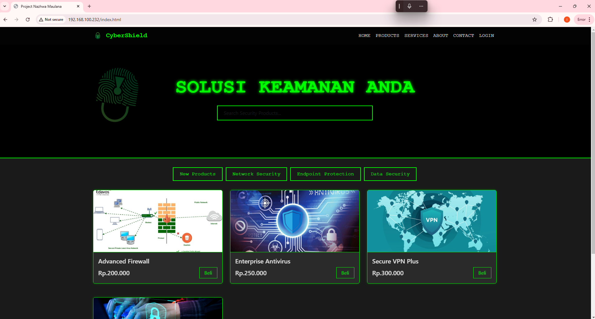

### Output DATABASE
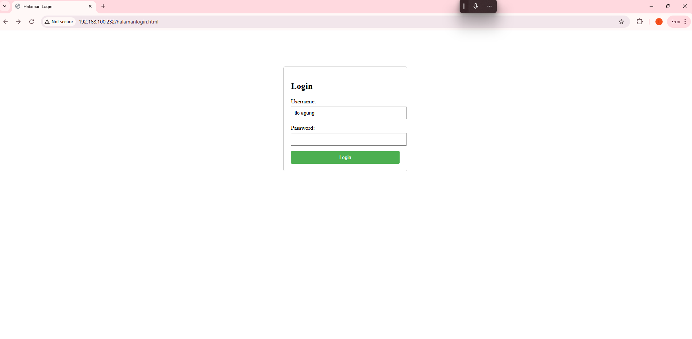
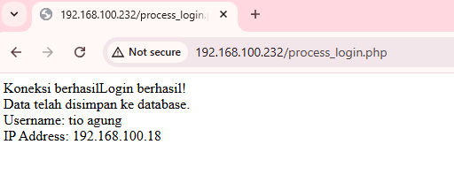
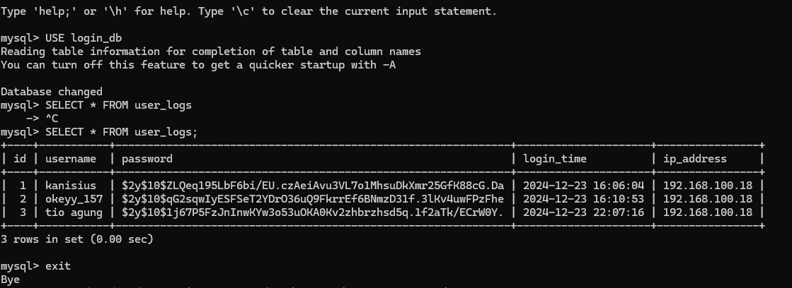


# 3. LAYANAN MYSQL
Layanan MySQL adalah sistem manajemen basis data relasional (RDBMS) yang digunakan 
untuk membuat tabel dan menyimpan data. MySQL merupakan perangkat lunak open 
source yang populer dan banyak digunakan di berbagai aplikasi web, situs web dinamis, 
dan sistem tertanam. 
Jangan Lupa untuk menghentikan layanan yang sedang aktif.
### Langkah 1: Instalasi MySQL
Pertama, instal MySQL Server dengan perintah berikut:
```bash
sudo apt update
sudo apt install mysql-server
```

### Langkah 2: Mengamankan Instalasi MySQL
Setelah instalasi selesai, amankan instalasi MySQL dengan menjalankan skrip keamanan:
```bash
sudo mysql_secure_installation
```
Ikuti petunjuk di layar untuk mengatur kata sandi root, menghapus pengguna anonim, menonaktifkan login root jarak jauh, dan menghapus database uji.

### Langkah 3: Masuk ke MySQL
Masuk ke shell MySQL sebagai pengguna root:
```bash
sudo mysql -u root -p
```
Masukkan kata sandi root yang Anda atur sebelumnya.

### Langkah 4: Membuat Database dan Pengguna
```bash
CREATE DATABASE login_db;
USE login_db;

CREATE TABLE user_logs (
    id INT AUTO_INCREMENT PRIMARY KEY,
    username VARCHAR(50) NOT NULL,
    password VARCHAR(255) NOT NULL,
    login_time TIMESTAMP DEFAULT CURRENT_TIMESTAMP,
    ip_address VARCHAR(45)
);
```

### Langkah 5: Buat file halamanlogin.html:
Membat file halamanlogin.html atau klo sudah ada edit sebagai berikut:
```html
<!DOCTYPE html>
<html>
<head>
    <title>Halaman Login</title>
    <style>
        .login-container {
            width: 300px;
            margin: 100px auto;
            padding: 20px;
            border: 1px solid #ccc;
            border-radius: 5px;
        }
        .form-group {
            margin-bottom: 15px;
        }
        input {
            width: 100%;
            padding: 8px;
            margin-top: 5px;
        }
        button {
            width: 100%;
            padding: 10px;
            background-color: #4CAF50;
            color: white;
            border: none;
            border-radius: 3px;
            cursor: pointer;
        }
    </style>
</head>
<body>
    <div class="login-container">
        <h2>Login</h2>
        <form action="process_login.php" method="POST">
            <div class="form-group">
                <label for="username">Username:</label>
                <input type="text" id="username" name="username" required>
            </div>
            <div class="form-group">
                <label for="password">Password:</label>
                <input type="password" id="password" name="password" required>
            </div>
            <button type="submit">Login</button>
        </form>
    </div>
</body>
</html>
```
Sebelumnya saya seperti biasa sudah cloning terlebih dahulu file web saya dari github yang berarti saya edit 
file halamanlogin.html nya:
```bash
git clone https://github.com/okeyy07-rgb/cybershild.github.io.git
```
### Langkah 6: Buat file config.php untuk koneksi database
```php
<?php
$host = '192.168.100.232';
$dbname = 'login_db';
$username = 'login_user';
$password = 'Login@070105';

try {
    $pdo = new PDO("mysql:host=$host;dbname=$dbname", $username, $password);
    $pdo->setAttribute(PDO::ATTR_ERRMODE, PDO::ERRMODE_EXCEPTION);
    echo "Koneksi berhasil";
} catch(PDOException $e) {
    echo "Koneksi gagal: " . $e->getMessage();
    die();
}
?>
```

### Langkah 7: Buat file process_login.php untuk proses login
```php
<?php
session_start();
require_once 'config.php';

if ($_SERVER["REQUEST_METHOD"] == "POST") {
    $username = $_POST['username'];
    $password = $_POST['password'];
    
    // Mendapatkan IP address user
    $ip_address = $_SERVER['REMOTE_ADDR'];
    
    try {
        // Menyimpan data login ke database
        $stmt = $pdo->prepare("INSERT INTO user_logs (username, password, ip_address) VALUES (?, ?, ?)");
        $stmt->execute([$username, password_hash($password, PASSWORD_DEFAULT), $ip_address]);
        
        // Jika berhasil, redirect ke WhatsApp
        // Ganti nomor WhatsApp sesuai kebutuhan
        $wa_number = '628xxxxxxxxxx';
        $wa_text = 'Halo, saya sudah login dan ingin melakukan pembelian';
        
        // URL encode pesan
        $encoded_text = urlencode($wa_text);
        
        // Redirect ke WhatsApp
        header("Location: https://api.whatsapp.com/send?phone=$wa_number&text=$encoded_text");
        exit();
        
    } catch(PDOException $e) {
        echo "Error: " . $e->getMessage();
        die();
    }
}
?>
```
### Langkah 8: Konfigurasi Nginx
```nginx
# Blok server HTTP (port 80)
server {
    listen 80 default_server;
    server_name 192.168.100.232;
    root /var/www/server1/cybershildd.gihub.io;
    index index.html index.php; # Tambahkan index.php

    # Tambahkan location untuk PHP
    location ~ \.php$ {
        fastcgi_split_path_info ^(.+\.php)(/.+)$;
        fastcgi_pass unix:/var/run/php/php7.4-fpm.sock; # Sesuaikan dengan versi PHP Anda
        fastcgi_index index.php;
        include fastcgi_params;
        fastcgi_param SCRIPT_FILENAME $document_root$fastcgi_script_name;
        fastcgi_param PATH_INFO $fastcgi_path_info;
    }

    location / {
        auth_basic "Restricted Content";
        auth_basic_user_file /etc/nginx/.htpasswd;
        try_files $uri $uri/ =404;
        ## Rate Limiting ##
        limit_req zone=one burst=5 nodelay;
        ## Security Headers ##
        add_header X-Frame-Options "SAMEORIGIN";
        add_header X-XSS-Protection "1; mode=block";
        add_header X-Content-Type-Options "nosniff";
        add_header Strict-Transport-Security "max-age=31536000; includeSubdomains; preload";
        ## Cache Control ##
        expires 1d;
        add_header Cache-Control "public, must-revalidate, proxy-revalidate";
    }
}

# Blok server HTTPS (port 443)
server {
    listen 443 ssl http2;
    server_name 192.168.100.232;
    ssl_certificate /etc/ssl/certs/nginx-selfsigned.crt;
    ssl_certificate_key /etc/ssl/private/nginx-selfsigned.key;
    root /var/www/server1/cybershildd.gihub.io;
    index index.html index.php; # Tambahkan index.php

    # Tambahkan location untuk PHP
    location ~ \.php$ {
        fastcgi_split_path_info ^(.+\.php)(/.+)$;
        fastcgi_pass unix:/var/run/php/php7.4-fpm.sock; # Sesuaikan dengan versi PHP Anda
        fastcgi_index index.php;
        include fastcgi_params;
        fastcgi_param SCRIPT_FILENAME $document_root$fastcgi_script_name;
        fastcgi_param PATH_INFO $fastcgi_path_info;
    }

    location / {
        auth_basic "Restricted Content";
        auth_basic_user_file /etc/nginx/.htpasswd;
        try_files $uri $uri/ =404;
        ## Security Headers ##
        add_header X-Frame-Options "SAMEORIGIN";
        add_header X-XSS-Protection "1; mode=block";
        add_header X-Content-Type-Options "nosniff";
        add_header Strict-Transport-Security "max-age=31536000; includeSubdomains; preload";
        ## Cache Control ##
        expires 1d;
        add_header Cache-Control "public, must-revalidate, proxy-revalidate";
    }
}
```
Disini saya mengikuti konfigurasi pada layanan nginx sebelumnya lalu menambahkan konfigurasi php untuk membuat Database 

### Langkah 9: Instalasi paket yang diperlukan
```bash
sudo apt update
sudo apt install php-fpm php-mysql mysql-server
```

### Langkah 10: Pastikan PHP-FPM berjalan
```bash
sudo systemctl start php7.4-fpm
sudo systemctl enable php7.4-fpm
```

### Langkah 11: Konfigurasi PHP untuk keamanan
```bash
sudo nano /etc/php/7.4/fpm/php.ini
```
Tambahkan/ubah setting berikut:
```ini
upload_max_filesize = 2M
max_execution_time = 30
max_input_time = 60
memory_limit = 128M
post_max_size = 8M
expose_php = Off
```

### Langkah 12: Restart Nginx dan PHP-FPM
```bash
sudo systemctl restart nginx
sudo systemctl restart php7.4-fpm
```

### Langkah 13: Membuat database dan user baru
Login ke MySQL sebagai root dulu:
```bash
sudo mysql -u root -p
```
Buat user dengan IP server:
```sql
CREATE USER 'login_user'@'192.168.100.232' IDENTIFIED BY 'Login@070105';
GRANT ALL PRIVILEGES ON login_db.* TO 'login_user'@'192.168.100.232';
FLUSH PRIVILEGES;
```
"192.168.100.232" sesuaikan dengan IP server Anda.

Cek apakah user sudah terbuat:
```sql
SELECT User, Host FROM mysql.user;
```
Cek grants untuk user tersebut
```sql
SHOW GRANTS FOR 'login_user'@'192.168.100.232';
```
Kemudian sesuaikan config.php

Pastikan juga MySQL mengizinkan koneksi dari IP tersebut dengan mengecek file konfigurasi MySQL:
```bash
sudo nano /etc/mysql/mysql.conf.d/mysqld.cnf
```
Cari baris bind-address dan ubah menjadi:
```bash
bind-address = 192.168.100.232
```
sesuaikan dengan Ip server Anda

Restart MySQL:
```bash
sudo systemctl restart mysql
```

### Langkah 14: Buat file process_login.php
```php
<?php
session_start();
require_once 'config.php';

if ($_SERVER["REQUEST_METHOD"] == "POST") {
    $username = $_POST['username'];
    $password = $_POST['password'];
    
    // Mendapatkan IP address user
    $ip_address = $_SERVER['REMOTE_ADDR'];
    
    try {
        // Menyimpan data login ke database
        $stmt = $pdo->prepare("INSERT INTO user_logs (username, password, ip_address) VALUES (?, ?, ?)");
        $stmt->execute([$username, password_hash($password, PASSWORD_DEFAULT), $ip_address]);
        
        // Cetak pesan sukses untuk testing
        echo "Login berhasil!<br>";
        echo "Data telah disimpan ke database.<br>";
        echo "Username: " . htmlspecialchars($username) . "<br>";
        echo "IP Address: " . htmlspecialchars($ip_address) . "<br>";
        
    } catch(PDOException $e) {
        echo "Error: " . $e->getMessage();
        die();
    }
}
?>
```
### Pastikan database dan tabel sudah dibuat
```sql
USE login_db;

CREATE TABLE user_logs (
    id INT AUTO_INCREMENT PRIMARY KEY,
    username VARCHAR(50) NOT NULL,
    password VARCHAR(255) NOT NULL,
    login_time TIMESTAMP DEFAULT CURRENT_TIMESTAMP,
    ip_address VARCHAR(45)
);
```

### Langkah 15: Berikan permission yang tepat
```bash
sudo chown -R www-data:www-data /var/www/server1/cybershildd.gihub.io
sudo chmod -R 755 /var/www/server1/cybershildd.gihub.io
sudo chmod 640 /var/www/server1/cybershildd.gihub.io/config.php
```

### Install ekstensi PHP PDO MySQL
```bash
sudo apt-get install php-mysql php-pdo
```
### Untuk Ubuntu/Debian, install package spesifik untuk versi PHP yang Anda gunakan
```bash
sudo apt-get install php7.4-mysql   # Sesuaikan dengan versi PHP Anda
```
### Setelah instalasi, restart PHP-FPM dan Nginx
```bash
sudo systemctl restart php7.4-fpm
sudo systemctl restart nginx
```
### Verifikasi ekstensi PDO sudah terinstall
```bash
php -m | grep pdo
```
### Buat file phpinfo.php untuk mengecek konfigurasi PHP
```bash
echo "<?php phpinfo(); ?>" | sudo tee /var/www/server1/cybershildd.gihub.io/phpinfo.php
```
Akses phpinfo.php melalui browser untuk memastikan PDO MySQL sudah aktif:
```
http://192.168.100.232/phpinfo.php
```
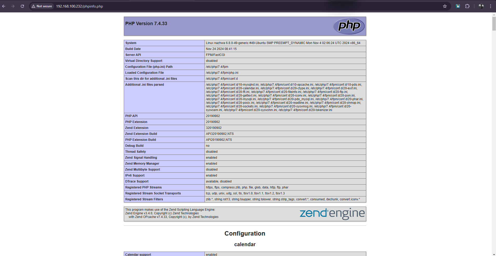


### Langkah 16: Jalankan aplikasi
Untuk menguji apakah data tercatat:
- Buka browser dan akses http://192.168.100.232/halamanlogin.html
- Lakukan login dengan username dan password test
- Cek database apakah data tercatat:
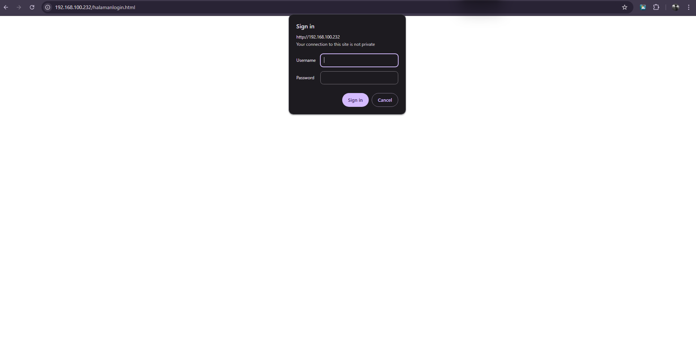


## 4. LAYANAN GRAFANA
Layanan Grafana adalah perangkat lunak open source yang digunakan untuk 
visualisasi data dan monitoring. Grafana dapat mengambil data dari berbagai
 sumber dan memungkinkan pengguna untuk membuat dashboard yang menampilkan data 
 dalam bentuk grafik, tabel, dan grafis lainnya. 

 ### Langkah 1: Install Dependencies
 Pastikan semua paket yang dibutuhkan sudah terinstal:
 ```bash
sudo apt-get update
sudo apt-get install -y apt-transport-https software-properties-common wget
```

### Langkah 2: Tambahkan Repository Grafana
Tambahkan repository Grafana ke sistem Anda:
```bash
sudo add-apt-repository "deb https://packages.grafana.com/oss/deb stable main"
sudo wget -q -O - https://packages.grafana.com/gpg.key | sudo apt-key add -
```

### Langkah 3: Install Grafana
Instal Grafana dari repository yang telah ditambahkan:
```bash
sudo apt-get update
sudo apt-get install grafana
```

### Langkah 4: Jalankan dan Mulai Grafana
Setelah instalasi selesai, jalankan dan mulai server Grafana:
```bash
sudo systemctl start grafana-server
sudo systemctl enable grafana-server
```

### Langkah 5: Akses Grafana melalui Browser
Buka browser Anda dan kunjungi alamat IP server Anda dengan menambahkan port 3000:
```plaintext
http://192.168.100.232:3000
```
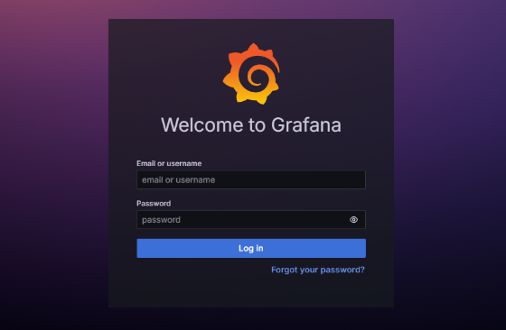

Lakukan login Default itu biasanya uername:admin password:admin

### Langkah 6: Add Data Sources
Pada Halaman utama pilih opsi pada bagian kiri halaman "Connction-Data Sources"
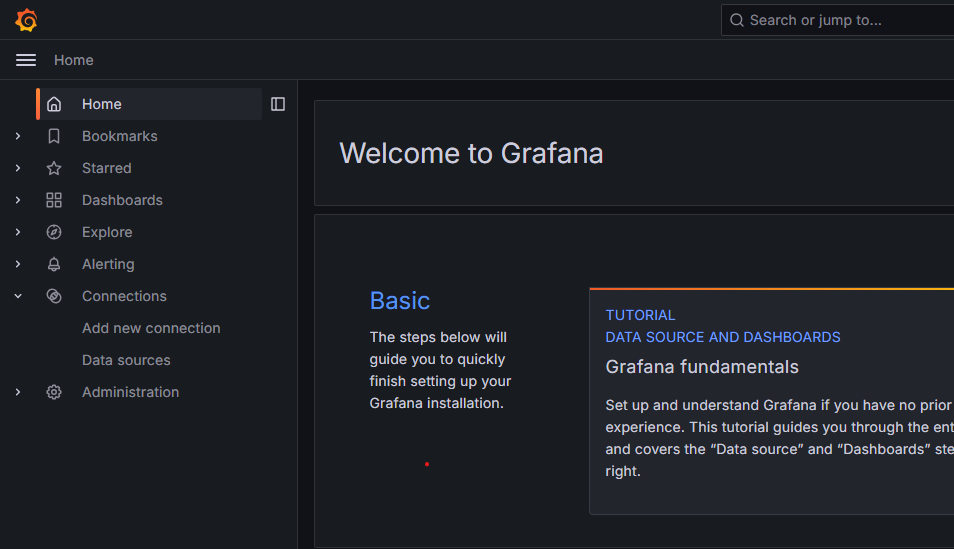

Setelah itu pilih opsi Add Data Sourch jika anda ingin menambahkan DATABASE yang ingin di tampilkan oleh grafana:
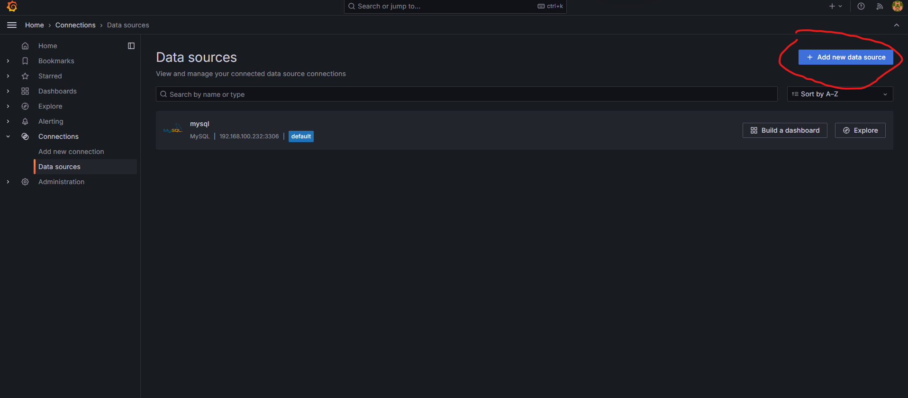

Setting sesuai kebutuhan:
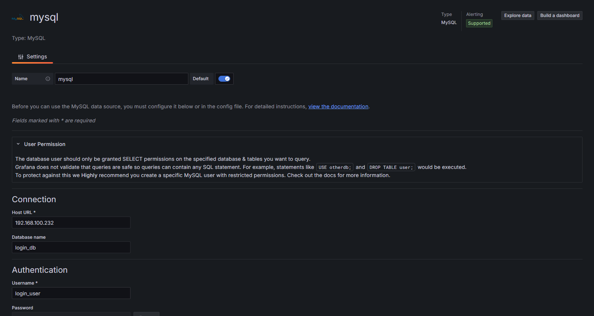

Jika sudah seleasai setting klik save & test:
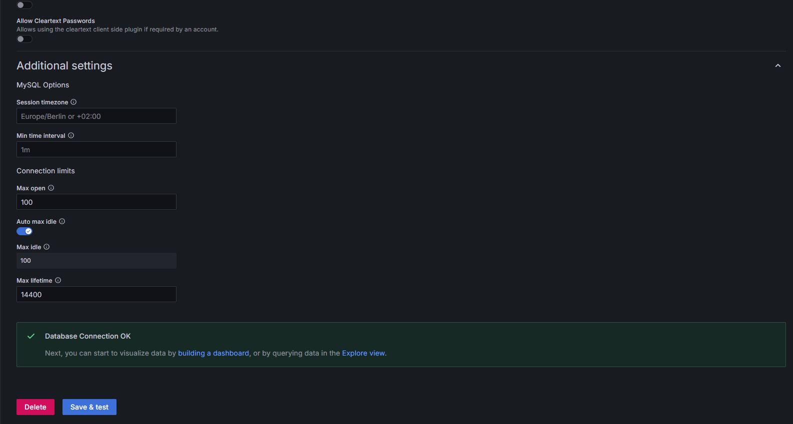

Setelah itu klik Explore Data:
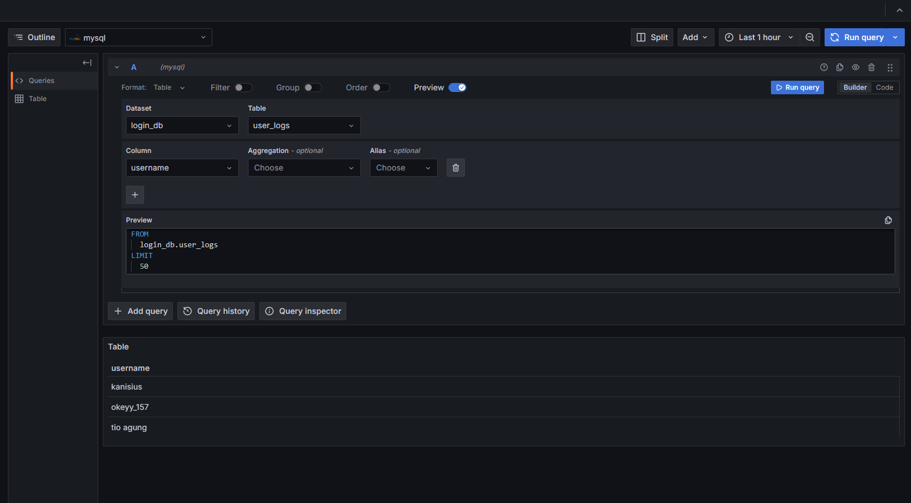
Disini kita dapat melihat Database kita yang sudah kita buat

## 5. LAYANAN DOCKER
Docker adalah platform perangkat lunak open-source yang memungkinkan pengguna untuk:
- Membuat, menguji, dan menjalankan aplikasi dalam kontainer
- Mengelola siklus hidup aplikasi dalam kontainer, dari pengembangan hingga pengujian dan penerapan
- Memastikan aplikasi yang dibuat di lingkungan pengembangan akan berfungsi dengan cara yang 
sama di lingkungan produksi 

### Langkah Instalasi dan Konfigurasi:
### Langkah 1: Persiapkan Prasyarat
Pastikan Anda menggunakan versi 64-bit dari Ubuntu yang kompatibel dengan Docker, seperti 
Ubuntu 20.04 (LTS) atau versi yang lebih baru.

### Langkah 2: Hapus Paket Konflik
Sebelum menginstal Docker, pastikan untuk menghapus paket yang mungkin akan berkonflik 
dengan Docker. Jalankan perintah berikut:
```bash
sudo apt-get remove docker.io docker-doc docker-compose docker-compose-v2 podman-docker containerd runc
```

### Langkah 3: Tambahkan Repository Docker
Tambahkan repository Docker ke sistem Anda dengan menjalankan perintah berikut:
```bash
sudo apt-get update
sudo apt-get install -y apt-transport-https ca-certificates curl gnupg lsb-release
curl -fsSL https://download.docker.com/linux/ubuntu/gpg | sudo apt-key add -
sudo add-apt-repository "deb [arch=amd64] https://download.docker.com/linux/ubuntu $(lsb_release -cs) stable"
```

### Langkah 4: Instal Docker
1. Update package database:

```bash
sudo apt-get update
```

2. Install Docker
```bash
sudo apt-get install -y docker-ce docker-ce-cli containerd.io
```

3. Mulai dan aktifkan Docker:
```bash
sudo systemctl start docker
sudo systemctl enable docker
```

### Langkah 5: Verifikasi Instalasi
```bash
sudo docker run hello-world
```
Jika Anda melihat pesan "Hello from Docker!", maka instalasi berhasil.

### Langkah 6: Cloning File WEB yang berada pada github
```bash
git clone https://github.com/okeyy07-rgb/cybershild.github.io.git
```

### Langkah 6: Buat Dockerfile
Di dalam direktori project Anda, buat file bernama Dockerfile dengan konten berikut:
```Dockerfile
# Gunakan image resmi Nginx
FROM nginx:alpine

# Salin konten situs web dari repository ke direktori Nginx
COPY ./cybershild.github.io /usr/share/nginx/html

# Ekspose port 80 untuk HTTP
EXPOSE 80

# Perintah untuk menjalankan Nginx
CMD ["nginx", "-g", "daemon off;"]
```

### Langkah 7: Bangun Ulang Image Docker
Bangun ulang image Docker menggunakan Dockerfile yang sudah diperbarui:
```bash
docker build -t my-html-website .
```

### Langkah 7: Jalankan Container Docker
Setelah image berhasil dibangun, jalankan container Docker:
```bash
docker run -d -p 80:80 --name my-html-container my-html-website
```


### Langkah 8: Verifikasi
Buka browser dan akses http://localhost atau IP server Anda untuk memastikan 
situs web HTML Anda berjalan di dalam container Docker.


